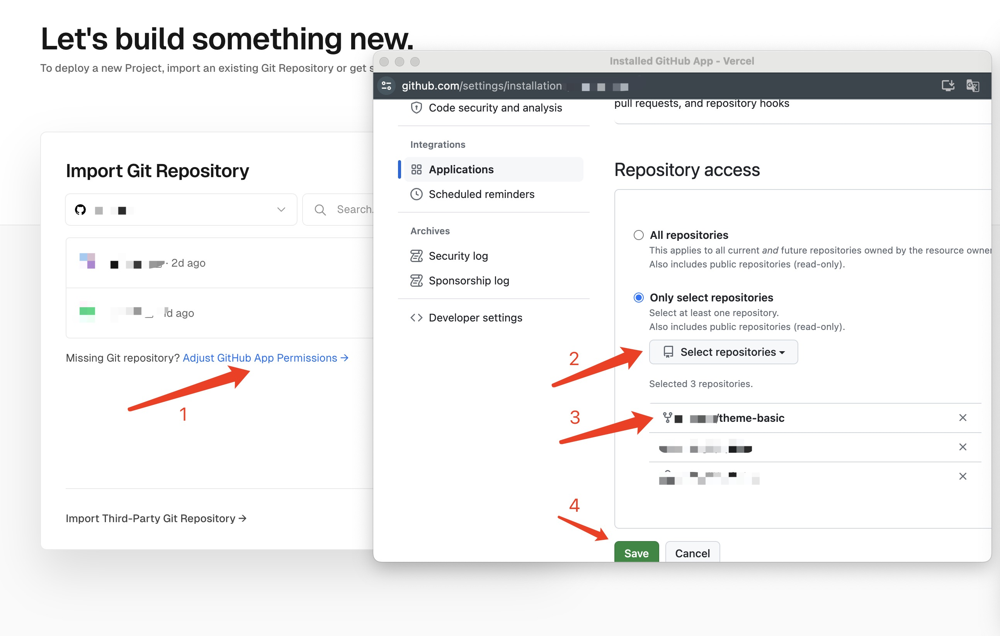
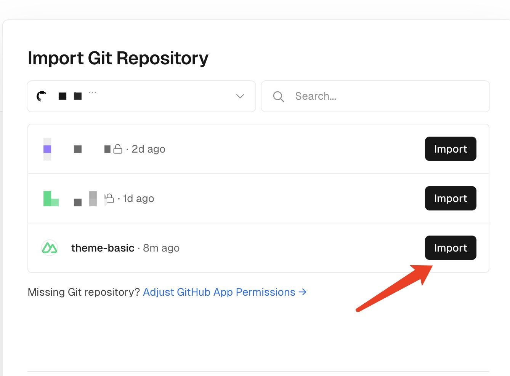
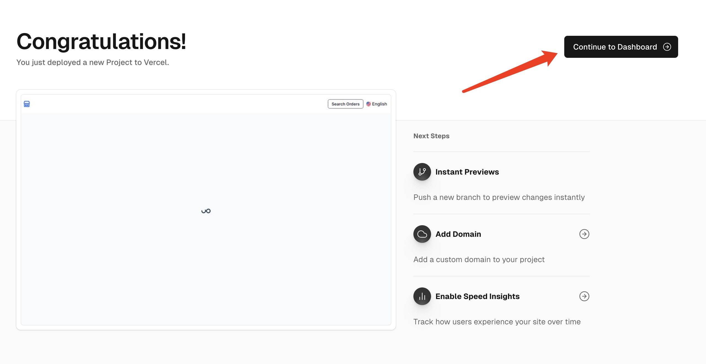
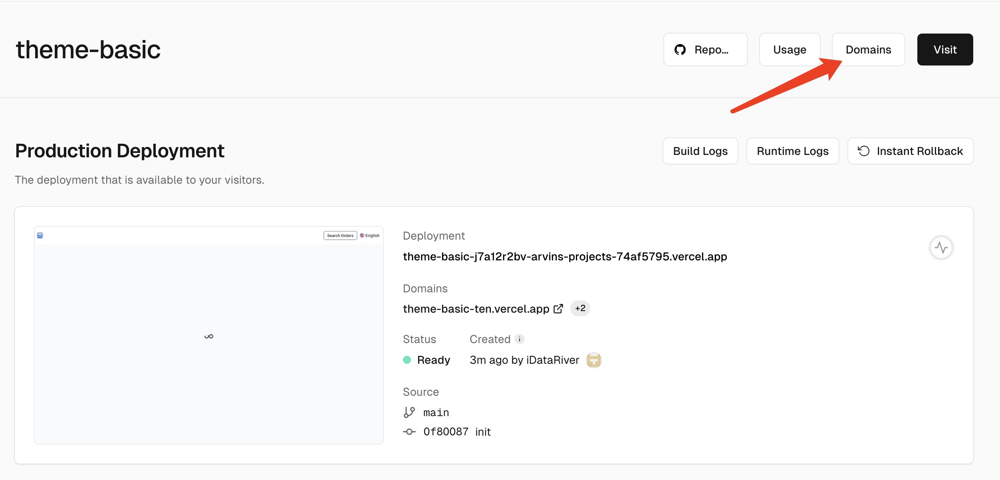
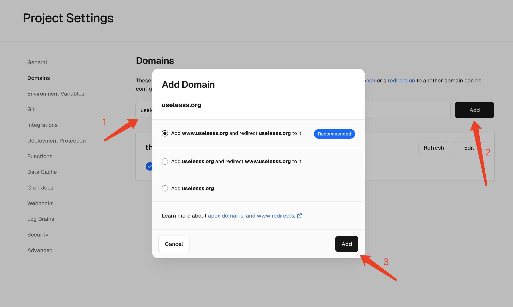
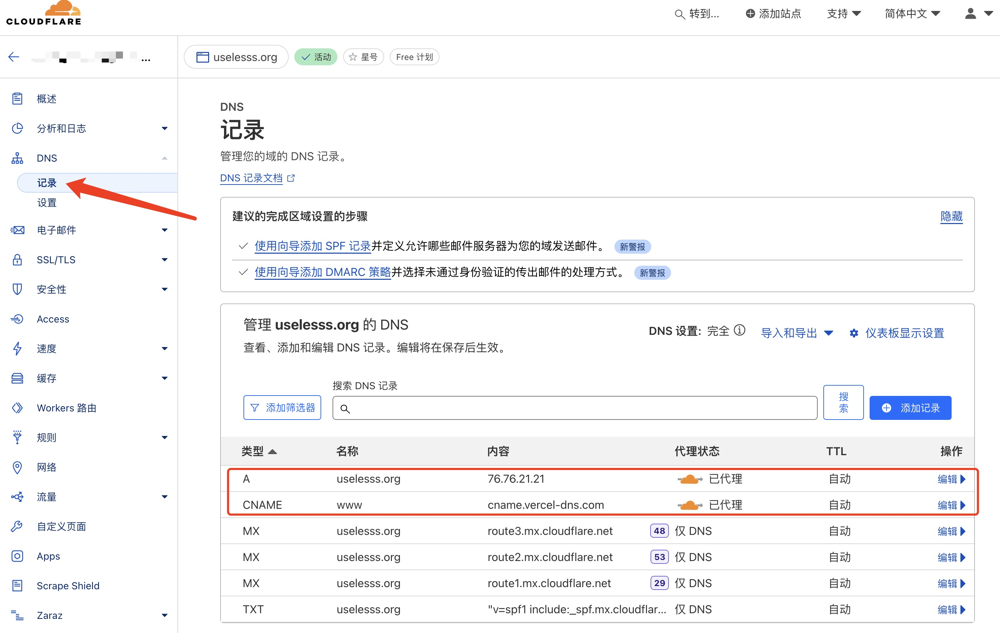

<h1 align="center">iDataRiver Theme(Basic)</h1>

本项目是由[`iDataRiver平台`](https://www.idatariver.com/zh-cn)开源的`数字商品`独立站主题模板。

网站的项目/商品管理请前往[`iDataRiver平台`](https://www.idatariver.com/zh-cn)的`控制台`->`项目管理`进行操作。

[商户入驻指南](https://docs.idatariver.com/zh/guide/04.01.merchant.html) / [演示 Demo](https://uselesss.org/) / [反馈 Issues](https://github.com/iDataRiver/theme-basic/issues)

## 模板特点

### 一键部署独立站, 零成本搭建

无需开发，直接按照操作流程部署，仅需10分钟，小白也能使用，且完全免费。

可完全使用自己的域名，不再依赖平台作为唯一入口。

### 基于iDataRiver的后端能力提供支持

本模板底层对接[`iDataRiver平台`](https://www.idatariver.com/zh-cn)的商户开放API, 直接使用其提供的数据+支付+风控+安全等各项能力。

商户只需要在控制台做好配置即可直接使用，不需要自己去面对复杂且成本高昂的底层实现。

### 自动支持全球多国语言翻译

不仅网站本身支持多语言，还默认支持将项目/商品描述进行智能翻译，让你的业务真正全球化。

### 一级代理商功能

本模板完全兼容平台商户的代理商功能, 详细介绍可见[文档](https://docs.idatariver.com/zh/guide/04.07.affiliates.html)

### 提供基础的API加密

本模板提供基础的API签名加密功能，也支持商户自定义签名密钥，有效增加逆向/ddos等攻击门槛

## 快速部署

本前端项目基于`Nuxt3`开发，可在如`vercel`这类主流的网站托管平台上直接部署上线。

步骤如下:

### 1. 注册你的`Github`账号，并将本项目fork到自己的账号下

### 2. 注册一个[`Vercel账号`](https://vercel.com/)，绑定步骤1的`Github`账号，并授权访问fork的本项目

### 3. 在`Vercel`控制台创建一个新项目，导入步骤2的项目:

在Vercel上创建项目

添加项目访问权限

导入要部署的项目

开始部署项目，并设置以下的环境变量:

#### `NUXT_IDATARIVER_MERCHANT_SECRET`
设置为你自己的商户开发者密钥，可在[`iDataRiver平台`](https://www.idatariver.com/zh-cn)控制台的商户设置里获取。
这个参数用来标识你的商户账号，所以必须填写。

#### `NUXT_PUBLIC_BASE_URL`
大部分情况下你需要使用自己的域名访问网站，这个值填写你自己的域名地址，格式如下: `https://www.idatariver.com`

#### `NUXT_PUBLIC_API_ENCRYPT_KEY`
可选参数，用于自定义API层面的加密签名，从而获得更好的安全保护，可以自行设置其值。

以上几个环境变量设置好之后，点击`Deploy`进行部署，等待一分钟左右你的商户独立站就能部署成功。

### 4. 绑定域名

如果3中没有配置域名，则可以跳过此步骤，这时你可以使用`Vercel`为你提供的域名进行访问。

强烈建议绑定自己的域名，因为每次重新部署后自动分配的Vercel域名都可能会变化。

部署成功后，点击部署好的项目右上角有一个`Domain`(域名)入口，配置好3中设定的域名，按照指定操作即可。

在Vercel对部署好的网站进行域名绑定

如果使用[`CloudFlare`](https://www.cloudflare.com/)免费托管域名，则需要如下配置:

添加Vercel要求的DNS解析记录后(代理模式)

将域名的`SSL/TLS`设置为`完全`端到端加密

### 5. 最后

至此，你已成功部署自己的独立站，如果需要升级/更新模板重新部署，需要在`Vercel`里将原先的项目删除，然后重新按照上面的步骤进行操作以便。

如果前端模板有更新，你想同步更新的话，需要在`fork`的项目里手动`Sync`同步一次，然后再重新部署。
